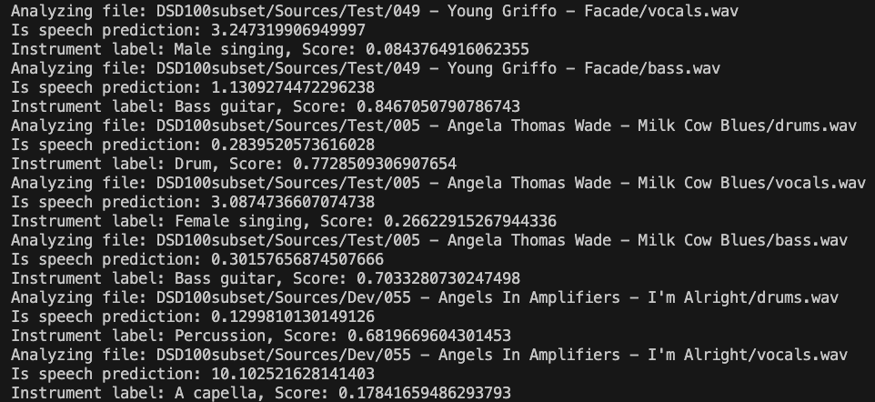
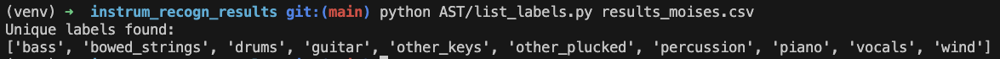
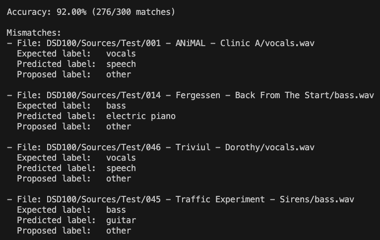

## About instrument_recognition_AST

The objective of this repository is to study the accuracy of the [AST (Audio Spectrogram Transformer) model](https://github.com/YuanGongND/ast) for instrument recognition/classification task. The code provided within the python scripts `analyze_dsd100.py` and `analyze_moises.py` is meant to validate the predictions by AST which is used in [Hi-Audio online platform](https://hiaudio.fr) for automatic annoation of audio tracks belonging to musical compositions. The code inside [AST folder](https://github.com/gilpanal/instrument_recognition_AST/tree/main/AST) corresponds to the one that can be found in [process_audio_thread](https://github.com/idsinge/hiaudio_backend/tree/main/process_audio_thread) of Hi-Audio back-end repository. The library [Essentia](https://essentia.upf.edu/essentia_python_tutorial.html) is also employed in this repository for consistency with the original code deployed in Hi-Audio online platform and is used for MIR (Music Information Retrieval) tasks like detecting speech vs singing voice, among others.

The scripts `analyze_dsd100.py` and `analyze_moises.py` run through the choosen dataset, either DSD100 or MoisesDB, and compare the proposed label for each audio track with the AST's output. To obtain consistent results, similar label sets from the AST model are mapped to match the existing values in the target dataset, thereby enabling comparison. In the case of DSD100 only the labels "bass," "vocals," and "drums" are used, and the corresponding groups are created as shown below.

```javascript
LABEL_CATEGORIES_DSD = {
    "vocals": [
        "singing", "mantra", "male singing", "female singing", 
        "child singing", "synthetic singing", "choir", "yodeling", 
        "chant", "humming", "rapping", "a capella", "vocal music"
    ],
    "drums": [
        "drum kit", "percussion", "drum machine", "drum", "snare drum", 
        "rimshot", "drum roll", "bass drum", "timpani", "tabla", 
        "cymbal", "hi-hat", "tambourine", "wood block"
    ],
    "bass": [
        "bass guitar", "double bass", "synthesizer", "sampler"
    ]
}
```

The same approach is applied to MoisesDB by defining a [different dictionary](https://github.com/gilpanal/instrument_recognition_AST/blob/70158392f8e993be706b6602a64aa6401703bc37/analyze_moisesdb.py#L10), mapping each label variant to its category. 

The results of the tagging task can be found in the CSV files `results_dsd100.csv` and `results_moises.csv`. In these files the information is organized in 4 columns:

1) `label`: the original label proposed in the dataset (ground truth)
2) `path`: the location of the file that is analyzed
3) `prediction`: the default output label from the AST model
4) `proposed_label`: the dataset equivalent label for the AST `prediction` depending on the instrument family. The `proposed_label` is established in the dictionary of "categories" for each dataset, i.e. "singing" (in AST) corresponds to "vocals" for DSD100.

The following table presents the accuracy metrics obtained through AST-based analysis of multitrack music datasets (DSD100 and MoisesDB) for one-class classification.

| Dataset      | AST accuracy                      |
|--------------|-----------------------------------|
| `DSD100`     | 92.00% (276/300 matches)          |
| `MoisesDB`   | 87.29% (2219/2542 matches)        |


## Download the datasets

DSD100: https://sigsep.github.io/datasets/dsd100.html

MoisesDB: https://music.ai/research/


## Run the code locally

**Python 10 required**

```bash
git clone https://github.com/gilpanal/instrument_recognition_AST.git

cd instrum_recogn_results

python3 -m venv venv

. venv/bin/activate

pip install -r requirements.txt
```
### Analyze the datasets

```bash
python analyze_dsd100.py /path/to/dsd100

python analyze_moisesdb.py /path/to/moisesdb
```
### Example of output for DSD100 AST analysis




### Get the list of unique labels in results file
```bash
python AST/list_labels.py results_dsd100.csv

python AST/list_labels.py results_moises.csv
```

### Example of output for MoisesDB listing unique labels script



### Compute accuracy of the results obtained for one dataset
```bash
python computeaccuracy.py results_dsd100.csv

python computeaccuracy.py results_moises.csv
```
### Example of output for DSD100 AST accuracy computation including mistmatches



## More info about Hi-Audio:

1) Journal article: https://hal.science/hal-05153739v1

2) Hi-Audio online platform: https://hiaudio.fr

3) News: https://hi-audio.imt.fr/2025/03/07/bridging-music-and-research/

4) Hi-Audio back-end repository: https://github.com/idsinge/hiaudio_backend
