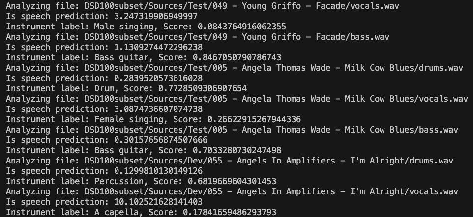
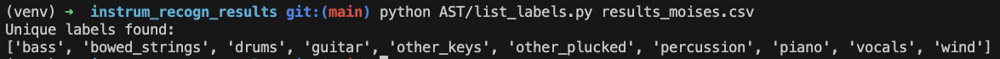
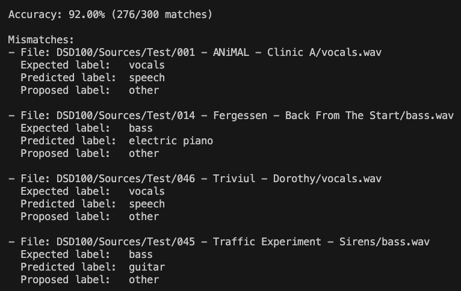

## About instrument_recognition_AST

This repository evaluates the accuracy of the [AST (Audio Spectrogram Transformer) model](https://github.com/YuanGongND/ast) for instrument recognition on multitrack music datasets. The main entry points are `analyze_dsd100.py` and `analyze_moisesdb.py`, which run AST-based labeling on local dataset copies and compare the predicted labels against dataset ground truth.

The code in the [`AST`](AST) directory is adapted from the instrument-recognition pipeline used in the [Hi-Audio platform](https://hiaudio.fr). It combines:

- AST for instrument label prediction
- [Essentia](https://essentia.upf.edu/essentia_python_tutorial.html) for MIR-related preprocessing and speech/singing detection
- dataset-specific label mappings so AST predictions can be compared with DSD100 and MoisesDB labels

The analysis scripts scan the selected dataset, infer a predicted AST label for each source track, map that label to a dataset-compatible category, and write the result to a CSV file.

### Prediction pipeline per audio stem

For each audio stem, the pipeline runs the following steps:

1. **Speech detection (Essentia):** a VGGish-based model scores how likely the audio is speech. If the score exceeds a threshold, the stem is classified as `"speech"` and AST inference is skipped entirely.
2. **Silence trimming:** the audio is split on silence and the active portion is extracted. If the result exceeds 60 seconds, a 30-second window (seconds 30–60) is used. The processed excerpt is written to a temporary file (`../data/processed/nosilence.wav`).
3. **Feature extraction:** the excerpt is resampled to 16 kHz, converted to a 128-dimensional log mel-filterbank spectrogram, and padded or trimmed to 1024 frames.
4. **AST inference:** the pretrained AST model outputs a sigmoid-activated confidence score for all 527 AudioSet classes simultaneously. This is a multi-label model — all 527 scores are produced in a single forward pass.
5. **Label selection:** the 527 scores are ranked from highest to lowest. The code iterates through the ranked list and selects the **first label that belongs to a curated instrument-specific subset** (`instrument_filtered_labels.py`, ~90 labels). Generic or non-instrument AudioSet labels — such as genre labels ("Rock music", "Jazz"), broad categories ("Music", "Musical instrument"), and ambient sounds — are not in this subset and are skipped automatically. The one exception is `"Speech"`: it is in the subset but is additionally skipped if the Essentia speech score from step 1 is below a lower confidence threshold.
6. **Label mapping:** the selected AST label is looked up in the dataset-specific mapping dictionary (`LABEL_CATEGORIES_DSD` or `LABEL_CATEGORIES_MOISES`). If no match is found, the `proposed_label` falls back to `"other"`.

| File | Role |
|---|---|
| `analyze_dsd100.py` | Entry point for DSD100; defines label mapping, walks stems, calls AST pipeline, writes CSV, prints accuracy |
| `analyze_moisesdb.py` | Entry point for MoisesDB; same flow with broader label categories |
| `commonutils.py` | Shared helpers: speech detection → AST inference → label mapping → CSV writing |
| `computeaccuracy.py` | Reads a result CSV and reports accuracy + mismatches |
| `AST/list_labels.py` | Reads a result CSV and prints unique ground-truth labels |
| `results_dsd100.csv` | Committed result file for DSD100 (300 stems) |
| `results_moises.csv` | Committed result file for MoisesDB (2542 stems, `moisesdb_v0.1`) |

For DSD100, only the labels `bass`, `vocals`, and `drums` are evaluated. The AST labels are grouped as follows:

```python
LABEL_CATEGORIES_DSD = {
    "vocals": [
        "singing", "mantra", "male singing", "female singing",
        "child singing", "synthetic singing", "choir", "yodeling",
        "chant", "humming", "rapping", "a capella", "vocal music"
    ],
    "drums": [
        "drum kit", "percussion", "drum machine", "drum", "snare drum", 
        "rimshot", "drum roll", "bass drum", "timpani", "tabla", 
        "cymbal", "hi-hat", "tambourine", "wood block"
    ],
    "bass": [
        "bass guitar", "double bass", "synthesizer", "sampler"
    ]
}
```

MoisesDB uses a broader mapping with categories such as `bass`, `bowed_strings`, `drums`, `guitar`, `other_keys`, `other_plucked`, `percussion`, `piano`, `vocals`, and `wind`. See the [MoisesDB dictionary](analyze_moisesdb.py) for the full mapping.

The repository includes example result files: `results_dsd100.csv` and `results_moises.csv`. Generated CSV files contain four columns:

1. `label`: the original label proposed in the dataset (ground truth)
2. `path`: the location of the file that is analyzed
3. `prediction`: the default output label from the AST model
4. `proposed_label`: the dataset-equivalent label derived from the AST `prediction`, using the mapping defined for that dataset (e.g. `"singing"` maps to `"vocals"` for DSD100)

The following table presents the accuracy obtained by comparing the single highest-scoring instrument label selected by AST (see pipeline description above) against the single ground-truth label assigned to each stem.

| Dataset    | AST accuracy                 |
|------------|------------------------------|
| `DSD100`   | 92.00% (276/300 matches)     |
| `MoisesDB` | 87.29% (2219/2542 matches)   |

> These numbers are derived directly from the committed result files `results_dsd100.csv` (300 evaluated stems) and `results_moises.csv` (2542 evaluated stems, obtained with `moisesdb_v0.1`).

<details>
<summary>Environment used to produce the published results</summary>

| | |
|---|---|
| Platform | macOS 15.4, arm64 |
| Python | 3.10.0 |
| Execution | CPU-only |
| `torch` | 2.11.0 |
| `torchaudio` | 2.11.0 |
| `essentia-tensorflow` | 2.1b6.dev1389 |
| `timm` | 0.4.5 |
| `numpy` | 1.26.4 |
| `pydub` | 0.25.1 |
| `soundfile` | 0.13.1 |

</details>


## Download the datasets

- **DSD100:** https://sigsep.github.io/datasets/dsd100.html
- **MoisesDB:** https://music.ai/research/

The scripts expect the following on-disk layouts:

```
DSD100/
└── Sources/
    ├── Dev/
    │   └── <track folder>/
    │       ├── bass.wav
    │       ├── drums.wav
    │       ├── other.wav      ← skipped automatically
    │       └── vocals.wav
    └── Test/
        └── ...

moisesdb/
└── moisesdb_v0.1/
    └── <track-id>/
        ├── bass/
        │   └── <uuid>.wav
        ├── drums/
        │   └── <uuid>.wav
        ├── guitar/
        │   └── <uuid>.wav
        ├── other/             ← skipped automatically
        │   └── <uuid>.wav
        └── vocals/
            └── <uuid>.wav
```

Pass `DSD100/Sources` as the argument to `analyze_dsd100.py` and `moisesdb/moisesdb_v0.1` to `analyze_moisesdb.py`.


## Prerequisites

- Python 3.10 (tested with Python 3.10; other versions have not been verified)
- A local copy of DSD100 and/or MoisesDB (see above)
- `ffmpeg` available on your system if your dataset contains `.mp3` files, as `pydub` uses it for audio decoding

This repository already includes the model files used by the scripts:

- `AST/pretrained_models/audio_mdl.pth` (~336 MB)
- `AST/models/genre_rosamerica-vggish-audioset-1.pb` (~275 MB)

No additional model download step is required. The model files are committed as regular git objects (no Git LFS).

> **⚠️ Note:** cloning this repository will download approximately **611 MB** of model data. Make sure you have sufficient disk space and a stable connection before cloning.

> **Note:** `essentia-tensorflow` can be the trickiest dependency to install depending on your platform. If it fails, follow the platform-specific instructions in the [Essentia documentation](https://essentia.upf.edu/installing.html).

> **CPU vs GPU:** the scripts run on CPU by default. If a CUDA-compatible GPU is available, PyTorch will use it automatically for AST inference. CPU-only execution is fully supported but will be slower.


## Run the code locally

```bash
git clone https://github.com/gilpanal/instrument_recognition_AST.git

cd instrument_recognition_AST

python3 -m venv venv

. venv/bin/activate

pip install -r requirements.txt
```

> **Installation note:** it is recommended to install into a clean virtual environment to avoid dependency conflicts. On some platforms, `essentia-tensorflow` also requires system-level packages (e.g. `libsndfile`, `ffmpeg`) to be installed before running `pip install`.

### Analyze the datasets

```bash
python3 analyze_dsd100.py /path/to/DSD100/Sources

python3 analyze_moisesdb.py /path/to/moisesdb/moisesdb_v0.1
```

Each script:

- recursively scans the dataset directory for `.wav` and `.mp3` files
- writes results to `results_dsd100.csv` or `results_moises.csv` — **re-running overwrites the existing file**
- flushes each row to the CSV as it is produced (streaming), so partial results are preserved if the run is interrupted
- prints the computed accuracy summary at the end of the run

During analysis, each audio file is silence-trimmed and exported to `../data/processed/nosilence.wav` (relative to the repository root). This directory is created automatically. The file is overwritten for each track processed and can be deleted after the run.

Dataset-specific assumptions:

- `analyze_dsd100.py`: the ground-truth label is the filename without extension (e.g. `bass.wav` → `bass`); files whose name contains `mix` or `other` are skipped entirely and excluded from evaluation
- `analyze_moisesdb.py`: the ground-truth label is the parent folder name (e.g. a file inside `vocals/` gets label `vocals`); hidden files and any folder named `other` are skipped entirely and excluded from evaluation

### Example of output for DSD100 AST analysis




### Get the list of unique ground-truth labels in a results file

```bash
python3 AST/list_labels.py results_dsd100.csv

python3 AST/list_labels.py results_moises.csv
```

### Example of output for MoisesDB listing unique labels script



### Compute accuracy of the results obtained for one dataset

```bash
python3 computeaccuracy.py results_dsd100.csv

python3 computeaccuracy.py results_moises.csv
```

`computeaccuracy.py` computes the fraction of rows where `label == proposed_label`, reports the overall accuracy as a percentage, and lists every mismatched file with its expected label, raw AST prediction, and mapped proposed label.

### Example of output for DSD100 AST accuracy computation including mismatches




## More info about Hi-Audio

1. Article at EURASIP Journal on Audio, Speech, and Music Processing: https://link.springer.com/article/10.1186/s13636-026-00459-0
2. Hi-Audio online platform: https://hiaudio.fr
3. News: https://hi-audio.imt.fr/2025/03/07/bridging-music-and-research/
4. Hi-Audio back-end repository: https://github.com/idsinge/hiaudio_backend


---

## Acknowledgements

This work is developed as part of the project *Hybrid and Interpretable Deep Neural Audio Machines*, funded by the **European Research Council (ERC)** under the European Union's Horizon Europe research and innovation programme (grant agreement No. 101052978).


We also thank [Teysir Baoueb](https://github.com/Teysir-B) (@Teysir-B) for proposing the AST model as a basis for musical instrument recognition and for her contributions during the early-stage proof of concept that laid the groundwork for this repository.


---

## How to Cite

If you use or reference the findings from this repository, please cite the published journal article. If you reuse the code directly, please also cite the repository. Both citations are provided below.

> Gil Panal, J. M., David, A., & Richard, G. (2026). The Hi-Audio online platform for recording and distributing multi-track music datasets. *Journal on Audio, Speech, and Music Processing*. https://doi.org/10.1186/s13636-026-00459-0

**BibTeX:**

```bibtex
@article{GilPanal2026,
  author  = {Gil Panal, Jos{\'e} M. and David, Aur{\'e}lien and Richard, Ga{\"e}l},
  title   = {The Hi-Audio online platform for recording and distributing multi-track music datasets},
  journal = {Journal on Audio, Speech, and Music Processing},
  year    = {2026},
  issn    = {3091-4523},
  doi     = {10.1186/s13636-026-00459-0},
  url     = {https://doi.org/10.1186/s13636-026-00459-0}
}
```

A preprint version is also available at: [https://hal.science/hal-05153739](https://hal.science/hal-05153739)

**Repository citation:**

> Gil Panal, J. M., David, A., & Richard, G. (2026). *Instrument Recognition with AST* [Software repository]. GitHub. https://github.com/gilpanal/instrument_recognition_AST

```bibtex
@misc{GilPanal2026ast,
  author = {Gil Panal, Jos{\'e} M. and David, Aur{\'e}lien and Richard, Ga{\"e}l},
  title  = {Instrument Recognition with AST},
  year   = {2026},
  url    = {https://github.com/gilpanal/instrument_recognition_AST}
}
```


---

## Third-party licenses

This repository depends on third-party code and model files, each carrying its own license. Users are responsible for complying with all applicable terms.

### AST — Audio Spectrogram Transformer

The code in the `AST/` directory is adapted from [YuanGongND/ast](https://github.com/YuanGongND/ast), including the pretrained model weights (`AST/pretrained_models/audio_mdl.pth`).  
License: **BSD 3-Clause** — see [`AST/AST_LICENSE`](AST/AST_LICENSE).

### Essentia (essentia-tensorflow)

The speech detection pipeline uses [Essentia](https://essentia.upf.edu), developed by the Music Technology Group at Universitat Pompeu Fabra.  
License: **AGPL-3.0-only**.

### Essentia pre-trained model

The committed model file `AST/models/genre_rosamerica-vggish-audioset-1.pb` is distributed by Essentia under the terms of the [Essentia Models License](https://essentia.upf.edu/models/LICENSE).  
License: **CC BY-NC-ND 4.0** (Creative Commons Attribution-NonCommercial-NoDerivatives 4.0 International), copyright Universitat Pompeu Fabra 2019–2021. The VGGish architecture component within this model is additionally licensed under **Apache 2.0**.

> **Note:** use of the committed Essentia pre-trained model file is subject to its CC BY-NC-ND 4.0 terms, including the non-commercial restriction.

### Other dependencies

| Package | License |
|---|---|
| `torch` | BSD 3-Clause |
| `torchaudio` | BSD 2-Clause |
| `timm` | Apache 2.0 |
| `pydub` | MIT |
| `soundfile` | BSD 3-Clause |
| `numpy` | BSD 3-Clause |

---

## License

This project is licensed under the [MIT License](LICENSE).  
Copyright (c) 2026 Hi-Audio.

> **Dataset licensing:** DSD100 and MoisesDB are distributed under their own separate licenses. Users are responsible for obtaining each dataset and complying with its terms independently of this repository's MIT license.
